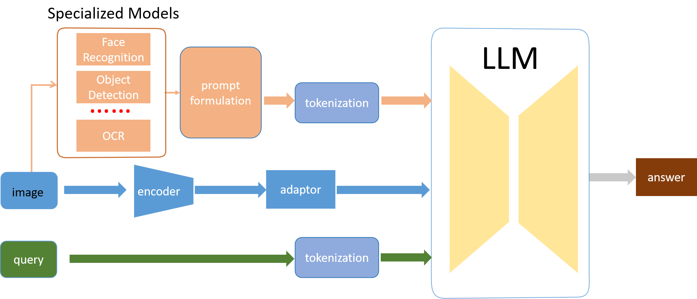

## Piculet: Specialized Model-Guided Hallucination Alleviation for MultiModal Large Language Models.  
---
🚀🚀🚀 Official implementation of **Piculet: Specialized Model-Guided Hallucination Alleviation for MultiModal Large Language Models** in ICIC 2024.

- **Authors**: [Kohou Wang*[1]](), [Xiang Liu*^[* denotes these authors contributed equally to this work and should be considered co-first authors.]](), [Zhaoxiang Liu\^[2]](), [Kai Wang](), [Shiguo Lian\^^[`^` denotes corresponding authors]]()

[^1]: These authors contributed equally to this work and should be considered co-first authors.
[^2]: Corresponding authors

- **Institutes**: AI Innovation Center, China Unicom, Beijing 100013, China; Unicom Digital Technology, China Unicom, Beijing 100013, China

We introduce a novel training-free method, named Piculet, for enhancing the input representation of MLLMs, thereby minimizing MLLMs' propensity for hallucinations. Piculet leverages multiple specialized models to extract descriptions of visual information from the input image and combine these descriptions with the original image and query as input to the MLLM. We evaluate our method both quantitively and qualitatively, and the results demonstrate that Piculet greatly decreases hallucinations of MLLMs. Our method can be easily extended to different MLLMs while being universal.

## 💡 highlights: 
- 🔥 We proposed a training-free, pre-process framework named Piculet to reduce the hallucinations of MLLMs
- 🔥 Our framework only requires one inference of the target MLLM and several other small deep learning models

## Data Preparation

As POPE, MME and LLaVa-QA90 are all a subset of coco's val2014, so you will need to download the coco's val2014 dataset.

## installation and running:
3 independent conda envs are needed:
- one for specialized models' sever, 
  installation and running details can be found at [specialized_models_server/readme.md](specialized_models_server/readme.md);
- one for QWen-vl-chat's running, installation and running details can be found at [qwen/readme.md](qwen/README.md);
- one for LLaVa-vl-1.5's running, installation and running details can be found at [llava's readme](llava/README.md);
  

## ❤️ Acknowledgments
- [QWen-VL](https://github.com/QwenLM/Qwen-VL) and [LLaVA](https://github.com/haotian-liu/LLaVA): the baseline models we compared. Thanks for their wonderful work.

## License
 **Usage and License Notices**: The code is intended and licensed for research use only. 